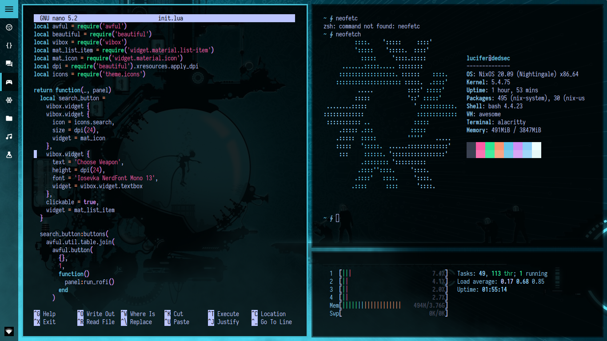

<p align="center">
  
</p>

<p align="center">
  <b> Sam's NixOS Setup </b>
</p>

****

***Dash***


****

***Tiled***



****
&#x200B;
&#x200B;
<p align="center">
  <b> Greetings Nix Users </b>
</p>

&#x200B;
&#x200B;


This is my AwesomeWM config ( Forked from Material Awesome

You are probably here for my AwesomeWM configuration.

The [setup section](#setup) will guide you through the installation process.

Here are some details about my setup:

+ **WM**: [AwesomeWM](https://github.com/awesomeWM/awesome/)
+ **OS**: [NixOS](https://nixos.org/)
+ **Shell**: [Bash with zsh at startup](https://wiki.archlinux.org/index.php/Zsh)
+ **Terminal**: [Alacritty](https://github.com/alacritty/alacritty)
+ **Editor**: [Vim](https://www.vim.org/)
+ **File Manager**: [Pcmanfm](https://wiki.lxde.org/en/PCManFM)
+ **Launcher**: [rofi](https://github.com/davatorium/rofi/)
+ **Browser**: Firefox

## Changes Made

- New release: Code name `NixSome`
- Customised From the great material-awesome
- Bluish Color 
- App-Menu with multi option ( alt+1,2,3,4)
- Chaotic code ( new to lua )

## Setup

Here are the instructions you should follow to replicate my AwesomeWM setup.

1. Install the Awesome in nix by
   
  Shell
  ```
  sudo nano /etc/nixos/configuration.nix
  ```
  in configuration.nix add
  ```
  services.xserver.windowManager.awesome.enable = true;
  ```
  Shell
  ```
  sudo nixos-rebuild switch
  sudo reboot
  ```
 
  
2. Install dependencies and enable services

  Shell
  ```
  sudo nix-env -iA nixos.rofi nixos.alacritty nixos.vim nixos.compton
  ```

3. Install needed fonts

   You will need to install a few fonts (mainly icon fonts) in order for text and icons to be rendered properly.

   Necessary fonts:
   + **Iosevka NerdFont** - [.local/fonts/Iosevka]

   Once you download them and unpack them, place them into `~/.fonts` or `~/.local/share/fonts`.
   - You will need to create the directory if it does not exist.
   - It does not matter that the actual font files (`.ttf`) are deep inside multiple directories. They will be detected as long as they can be accessed from `~/.fonts` or `~/.local/share/fonts`.

   Finally, run the following in order for your system to detect the newly installed fonts.
   ```shell
   fc-cache -v
   ```

4. Install my AwesomeWM configuration files

   In shell
   ```
   git clone https://github.com/Sam1431/NixSome.git   
   ```
   Location for files to be copied
   ```
   NixSome/.config/* ------> /home/<user>/.config
   NixSome/.local/share/fonts/* ----->/home/<user>/.local/share/fonts
   NixSome/.bashrc ------> /home/<user>/.bashrc
   NixSome/.zshenv ------> /home/<user>/.zshenv
   ```

4. Configure stuff
  ```
  Change default apps AND add startup apps in /awesome/configuration/apps.lua
 ```
5. Login with AwesomeWM 🎉

  -  Congratulations, at this point you should be ready to log out of your current desktop and into AwesomeWM.
   
  -  Your login screen should have a button that lets you change between available desktop sessions.it will be none+awesome

  - Use it as a base,customise it or just COPY AND PASTE

## Keybinds

I use <kbd>super</kbd> AKA Windows key as my main modifier.

#### Keyboard
| Keybind | Action |
| --- | --- |
| <kbd>super + enter</kbd> | App Menu |
| <kbd>super + shift + enter</kbd> | Spawn Alacritty |
| <kbd>super + q</kbd> | Close client |
| <kbd>super + space</kbd> | Switch between in layouts |
| <kbd>super + [1-0]</kbd> | View tag AKA change workspace |
| <kbd>super + shift + [1-0]</kbd> | Move focused client to tag |
| <kbd>super + s</kbd> | Move to a lower workspace |
| <kbd>super + w</kbd> | Move to a upper workspace |
| <kbd>super + [Left , Right]</kbd> | Change focus by direction |
| <kbd>alt + Shift + [arrow keys]</kbd> | Resize client |
| <kbd>super + f</kbd> | Toggle fullscreen |
*... And many many more.*

#### Mouse
| Mousebind | Action |
| --- | --- |
| super + `left click (drag)` | Move |
| super + `right click (drag)` | Resize |

****
Recommendation
```
- OS              - NixOS
- Package Manager - Nix
- Window Manager  - AwesomeWM (Install instruction for nix included)
- Terminal        - Alacritty
- Web Browser     - luakit ( If you are familiar with lua) else Firefox
- TextEditor      - TUI:Vim , GUI:Geany
- FileManager     - TUI:Ranger , GUI:Pcmanfm
```

****
- And do not forget to fork this repo to add you own bling to it

****

